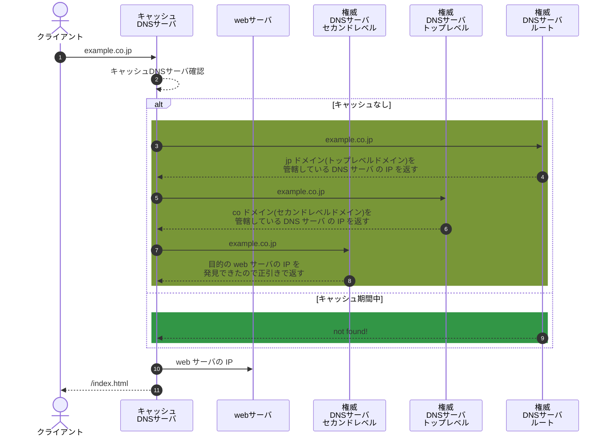

```mermaid:

sequenceDiagram
%% settings
autonumber
%% node section
actor user as クライアント
participant cache as キャッシュ<br>DNSサーバ
participant web as webサーバ
participant sec as 権威<br>DNSサーバ<br>セカンドレベル
participant top as 権威<br>DNSサーバ<br>トップレベル
participant root as 権威<br>DNSサーバ<br>ルート
%% allow list
user->>cache: example.co.jp
cache -->> cache: キャッシュDNSサーバ確認
alt キャッシュなし
    rect rgb(120, 150, 55)
    cache ->> root: example.co.jp
    root -->> cache: jp ドメイン(トップレベルドメイン)を<br>管轄している DNS サーバ の IP を返す

    cache ->> top: example.co.jp
    top -->> cache: co ドメイン(セカンドレベルドメイン)を<br>管轄している DNS サーバ の IP を返す

    cache ->> sec: example.co.jp
    sec -->> cache: 目的の web サーバの IP を<br>発見できたので正引きで返す
    end
else キャッシュ期間中
    rect rgb(50, 150, 70)
    root -->> cache: not found!

    end
end
cache ->> web: web サーバの IP
cache -->> user: /index.html
```
com ドメインを管轄している DNS サーバは知っているので、その IP アドレスを返す